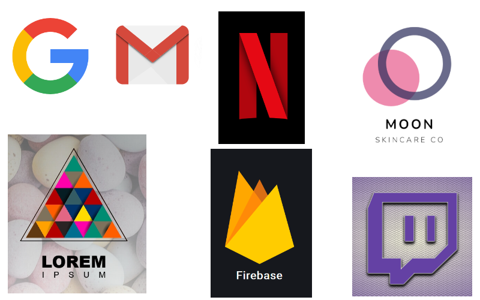

# CSS трансформация. Лого.

Твоя задача - сверстать свой собственный лого.
Ты можешь добавлять неограниченное количество элементов и работать со стилями,так как тебе угодно.

Для вдохновения можешь посмотреть на [эти логотипы](https://freefrontend.com/css-logos/) (сверстаны на чистом CSS):
<h1 align="center"></h1>

### Release 0. Подготовка
- Создай файлы `index.html` и `style.css`, подключи их друг к другу
- Представь логотип, который должен у тебя получиться, а лучше нарисуй его

### Release 1. Реализация
- Создай необходимую разметку в файле `index.html`
- Добавь необходимые стили в файле `style.css`

### Release 2. Деплой
- Сделай `Pull request`
- Поделись скриншотом своего логотипа в канале группы
